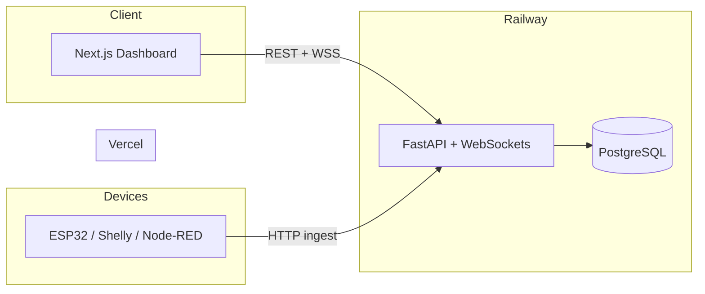

# SmartEnergy

**Real-time smart meter monitoring and energy analytics for homes and small businesses.**

Live dashboard, consumption insights, bill forecasting, alerts, and IoT meter integration — built as a production-style full-stack platform.

**Author:** [Akshay Sahu](https://github.com/Akshaysahu9)

---

## Live Demo

| | URL |
|---|---|
| **Web app** | [smartenergy-ai.vercel.app](https://smartenergy-ai.vercel.app) |
| **API health** | [smartenergy-ai-production.up.railway.app/health](https://smartenergy-ai-production.up.railway.app/health) |

**Demo login**

| Field | Value |
|-------|-------|
| Email | `demo@smartenergy.ai` |
| Password | `demo1234` |

The demo account uses a built-in meter simulator with live WebSocket updates. Switch to **API mode** in Settings to connect a real device.

---

## Highlights

- **Live monitoring** — WebSocket stream + polling fallback for power, voltage, and energy readings
- **Smart meter ingest** — REST API with per-meter API keys (`X-Meter-Key`)
- **Analytics** — Hourly, daily, weekly, monthly, and yearly consumption views
- **Bill estimation** — Indian DISCOM-style slab tariff calculations
- **Prepaid balance** — Simulated prepaid metering with low-balance alerts
- **Alerts** — High usage, voltage fluctuation, and bill threshold notifications
- **Reports** — PDF export for consumption and billing summaries
- **Forecasts** — Statistical energy predictions (extensible with ML training scripts)
- **Carbon footprint** — CO₂ estimates from consumption data
- **Energy assistant** — In-app chat for usage tips and bill questions
- **Multi-source data** — Simulated, manual entry, CSV import, or live API ingest

---

## Architecture



---

## Tech Stack

| Layer | Technologies |
|-------|----------------|
| **Frontend** | Next.js 14, TypeScript, Tailwind CSS, Recharts |
| **Backend** | FastAPI, SQLAlchemy (async), Pydantic, WebSockets |
| **Database** | PostgreSQL (production) · SQLite (local dev) |
| **Auth** | JWT access + refresh tokens, bcrypt password hashing |
| **ML / analytics** | scikit-learn, pandas, numpy (optional LSTM / Prophet training) |
| **Deploy** | Vercel (frontend) · Railway (API + Postgres) · Docker |
| **CI** | GitHub Actions (lint, build, API tests) |

---

## Project Structure

```
smartenergy-ai/
├── apps/
│   ├── web/                 # Next.js frontend (dashboard, auth, charts)
│   └── api/                 # FastAPI backend (REST, WebSocket, ingest)
│       ├── app/
│       │   ├── routers/     # auth, meters, bills, analytics, predictions…
│       │   └── services/    # simulator, billing, ML, reports, alerts
│       ├── alembic/         # database migrations
│       └── Dockerfile       # production container
├── ml/
│   └── training/            # optional model training scripts
├── packages/shared/         # shared TypeScript types
├── .github/workflows/       # CI pipeline
├── docker-compose.yml       # local Postgres + services
├── DEPLOY.md                # full deployment guide
└── railway.toml             # Railway config
```

---

## Getting Started

### Prerequisites

- **Node.js** 20+
- **Python** 3.11+
- **npm** or **pnpm**

### 1. Clone the repository

```bash
git clone https://github.com/Akshaysahu9/Smartenergy-AI.git
cd Smartenergy-AI
```

### 2. Backend (API)

```bash
cd apps/api
python -m venv .venv

# Windows
.venv\Scripts\activate

# macOS / Linux
source .venv/bin/activate

pip install -r requirements.txt
copy .env.example .env          # Windows
# cp .env.example .env            # macOS / Linux

set PYTHONPATH=.                  # Windows
# export PYTHONPATH=.             # macOS / Linux

python -m uvicorn app.main:app --host 127.0.0.1 --port 8001
```

From repo root: `npm run dev:api`

> **Tip:** Avoid `--reload` on Windows with SQLite — it can cause database lock errors. Use a single API process for local development.

API runs at **http://127.0.0.1:8001** · Docs at **http://127.0.0.1:8001/docs**

### 3. Frontend (Web)

```bash
cd apps/web
copy .env.example .env.local      # Windows
# cp .env.example .env.local      # macOS / Linux

npm install
npm run dev
```

Open **http://localhost:3000** and sign in with the demo credentials above.

### 4. Optional — seed demo data manually

```bash
cd apps/api
set PYTHONPATH=.
python scripts/seed.py --seed-only
```

---

## Environment Variables

### Backend (`apps/api/.env`)

| Variable | Description |
|----------|-------------|
| `DATABASE_URL` | `sqlite+aiosqlite:///./smartenergy.db` (local) or `postgresql+asyncpg://…` (prod) |
| `JWT_SECRET` | Secret key for signing tokens |
| `CORS_ORIGINS` | Allowed frontend origin(s), comma-separated |
| `FRONTEND_URL` | Public frontend URL |
| `PUBLIC_API_URL` | Public API base URL |
| `SEED_DEMO_ON_STARTUP` | `true` to auto-create demo user on boot |
| `OPENAI_API_KEY` | Optional — enables AI energy assistant chat |

### Frontend (`apps/web/.env.local`)

| Variable | Description |
|----------|-------------|
| `NEXT_PUBLIC_API_URL` | Backend URL (e.g. `http://localhost:8001`) |
| `NEXT_PUBLIC_WS_URL` | WebSocket URL (e.g. `ws://localhost:8001`) |

---

## Deployment

Full step-by-step instructions: **[DEPLOY.md](./DEPLOY.md)**

**Quick reference**

| Platform | Root directory | Key settings |
|----------|----------------|--------------|
| **Vercel** | `apps/web` | `NEXT_PUBLIC_API_URL`, `NEXT_PUBLIC_WS_URL` |
| **Railway** | `apps/api` | `DATABASE_URL`, `JWT_SECRET`, `CORS_ORIGINS`, `SEED_DEMO_ON_STARTUP` |

After deploying the frontend, set `CORS_ORIGINS` and `FRONTEND_URL` on Railway to your Vercel URL, then redeploy the API.

---

## IoT / Real Meter Integration

1. Open **Settings → Live Smart Meter API**
2. Generate an API key for your meter
3. POST readings to the ingest endpoint:

```bash
curl -X POST "https://YOUR_API/meters/METER_ID/ingest" \
  -H "X-Meter-Key: YOUR_KEY" \
  -H "Content-Type: application/json" \
  -d '{
    "power_watts": 1250,
    "voltage": 230,
    "energy_kwh": 4521.3
  }'
```

Compatible with **Shelly**, **ESP32**, **Node-RED**, **Raspberry Pi**, or any HTTP client.

**Data modes:** `simulated` · `manual` · `csv` · `api`

---

## API Overview

| Area | Endpoints |
|------|-----------|
| Auth | `POST /auth/register` · `POST /auth/login` · `GET /auth/me` |
| Meters | CRUD, readings, WebSocket live stream, CSV import |
| Ingest | `POST /meters/{id}/ingest` (API key auth) |
| Analytics | Consumption aggregates, comparisons, trends |
| Bills | Estimates, PDF reports, DISCOM-style slabs |
| Alerts | Threshold-based notifications |
| Predictions | Usage forecasts and anomaly detection |
| Health | `GET /health` |

Interactive docs: `/docs` (Swagger) · `/redoc`

---

## Scripts

| Command | Description |
|---------|-------------|
| `npm run dev:web` | Start Next.js dev server |
| `npm run dev:api` | Start FastAPI on port 8001 |
| `npm run build:web` | Production frontend build |
| `npm run seed` | Seed demo database |
| `npm run train:ml` | Run ML training pipeline |

---

## License

MIT — see [LICENSE](./LICENSE) if present, otherwise free to use with attribution.

---

<p align="center">
  Built by <strong>Akshay Sahu</strong> · SmartEnergy Platform
</p>
